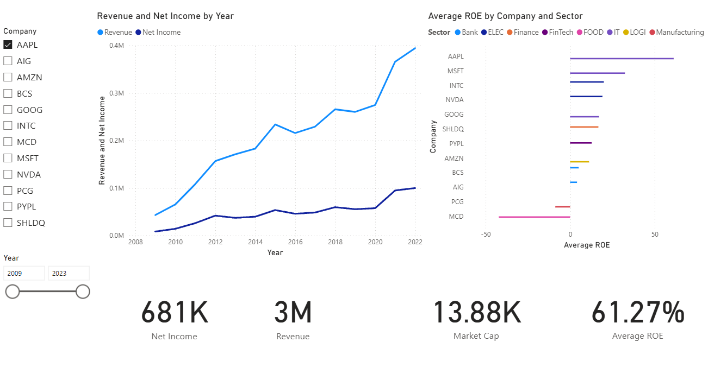

# Interactive Financial Analysis Dashboard 📊

This project is an interactive dashboard built with Power BI that visualizes and analyzes the financial performance of public companies. The data backend is a PostgreSQL database, with data processing and metric calculation performed using SQL.

## ✨ Key Features

-   **ETL Process:** Designed and implemented a process to extract data from a CSV file, clean it, and load it into a PostgreSQL database.
-   **SQL-Powered Metrics:** Authored SQL queries to calculate and validate key financial indicators, including Return on Equity (ROE) and Net Profit Margin.
-   **Interactive Filtering:** The dashboard allows users to dynamically filter data by company and year.
-   **Trend Analysis:** A line chart visualizes changes in revenue and net income over time for a selected company.
-   **Comparative Analysis:** A bar chart compares the performance (e.g., ROE) of multiple companies, color-coded by sector.

## 🛠️ Tech Stack

-   **SQL** (PostgreSQL)
-   **Power BI**
-   **DAX** (for calculated columns and measures in Power BI)
-   **DBeaver** (for database management)

## 📸 Dashboard Preview

Here is a preview of the interactive dashboard.

## 🗂️ SQL Scripts

The SQL queries used for creating the table schema, performing calculations, and validating the data can be found in the `.sql` files within this repository.
